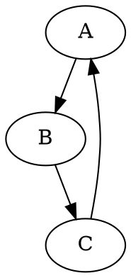

+++
title = "Emacs 二三事"
author = ["Grant"]
lastmod = 2026-01-13T14:04:15+08:00
tags = ["Emacs"]
categories = ["CS"]
draft = false
+++

---


## Daily Life {#daily-life}


### Emacs install {#emacs-install}

For `debian` we can use

```sh
apt install -t bookworm-backports emacs
```

to install latest version. After that we can use `apt` to install `emacs-pgtk`.

For `MacOS` we can install `emacs-mac` by

```sh
brew tap
brew install --cask emacs-mac
```

Now I am using emacs-plus@30. If you cannot find Emacs in </Applications>, you can use `ln -s /opt/homebrew/opt/emacs-plus@30/Emacs.app /Applications` to new a link.


### Emacsclient {#emacsclient}

Use `emacsclient` to replicate Emacs frames with one Emacs server from `emacs --daemon`.

`emacs-mac` cannot use `emacsclient` to open one gui Emacs frame.
<https://github.com/railwaycat/homebrew-emacsmacport/issues/381>


### Buffer {#buffer}

Use `C-x C-b` to skim your buffers. Now you can use `d` to mark the buffers you wanna remove, and press `x` to execute the order you want.


### Dired {#dired}

Basic methods:

-   m: `dired-mark`
-   u: `dired-unmark`
-   !: `dired-do-shell-command`
-   +: `dired-create-directory`, make a new directory.
-   .: `dired-clean-directory`
-   C: `dired-do-copy`
-   D: `dired-do-delete`
-   M: `dired-do-chmod`
-   R: `dired-do-rename`
-   U: `dired-unmark-all-marks`
-   Z: `dired-do-compress`, which only compress current file and is useless.
-   c: `dired-do-compress-to`, which can choose mark files and the compressed file format.
-   v: `dired-view-file`
-   g: `revert-buffer`[^fn:1]


### Gnus {#gnus}

Three parts: Group buffer, Summary buffer, Article buffer.

Useful key bindings:

-   `B m`: Move the article from one mail group to another (to delete)
-   `M-s`: Search through all subsequent articles for a regexp in Summary buffer
-   `G G`: Search in Group Buffer
-   `S r`: Mail a reply to the author of the current article


### Window {#window}

使用 Mac 上的 Emacs 时最好不要把窗口最小化，不然可能会无响应。

使用 `C-x 5 0` 关闭 isolated window (frame).


### Key Binding {#key-binding}

use-package/bind-key (prior):

```elisp
(bind-key* "C-x u" #'hydra-undo-tree/body)
```

代码整体左（右）移: `C-x TAB` 后接 &lt;- -&gt;.

对应括号跳转: `C-M-f` and `C-M-b`.


### Profiler {#profiler}

Use `profiler-start` to monitor your functions and programs in cpu or mem.

Use `profiler-report` to check it, so you can find which one leads to the halt of Emacs.

Do not forget to close this, or you have to force your Emacs to exit.


### Subword {#subword}

Activate `subword-mode` to deal with camel words better in codes.


### Text Scale {#text-scale}

-   `C-x C-+`: increase the font size.
-   `C-x C--`: decrease the font size.


### Record Position {#record-position}

-   `C-spc C-spc`: mark the position.
-   `C-u C-spc`: return the marked position.
-   Use `remember-init` and `remember-jump` function.


### Thoughts {#thoughts}

-   <span class="timestamp-wrapper"><span class="timestamp">&lt;2024-10-18 Fri&gt; </span></span> Restart Emacs when changing displayer.


## Elisp {#elisp}


### Quote {#quote}

`'(x y)` = `(quote (x y))`.


### Backquote {#backquote}

Backquote constructs allow you to quote a list, but selectively evaluate elements of that list if you use `,` inside.

```emacs-lisp
`(a list of ,(+ 2 3) elements)
```


### Cite {#cite}

-   `'`: ordinary cite
-   `#'`: functional cite

    `#'foo` is the same as `(function foo)`.


### Hook {#hook}

You should add a mode to a hook, not a mode-hook to a hook.

```emacs-lisp
(add-hook 'prog-mode-hook 'outli-mode) ;; like this
```


### Let {#let}

The `let` creates a name for a _local variable_ that overshadows any use of the same name outside the `let` expression (in computer science jargon, we call this _binding_ the variable).[^fn:2]

```emacs-lisp
(let ((zebra "stripes")
      (tiger "fierce"))
  (message "One kind of animal has %s and another is %s."
           zebra tiger))
```

Combine `let` and `if`:

```emacs-lisp
(let* ((x 10) ;; Use let* to assure y know x in let*
     (y (if (> x 0)
            1
          -1)))
(message "x is: %d, y is: %d" x y)) ;; d->value, s->string
```


### Formatting Strings {#formatting-strings}

-   `%s`: string
-   `%c`: char
-   `%f`: decimal-point notation for a float
-   `%e`: exponential notation for a float
-   `%d`: decimal value
-   `%x`: hex value
-   `%o`: octal value

<!--listend-->

```emacs-lisp
(let ((x 42)
      (name "Alice"))
  (message "%s has number %d" name x))
```


## LaTeX {#latex}


### CDLaTeX {#cdlatex}

-   `lbl + TAB`: insert label automatically.
-   `ref + TAB`: reference label automatically.


### RefTeX {#reftex}

-   `reftex-parse-one`: update label list (environment number).
-   `reftex-label` `C-c (` : insert label.
-   `reftex-reference` `C-c )` : reference label.
-   `reftex-citation` `C-c [` : cite.
-   `reftex-toc` `C-c =` : show toc.


## Org {#org}


### Output {#output}

-   docx: use `#+pandoc_options: reference-doc:./templates/templates.docx`. Confirm you have installed `pandoc` and prepared the template.


### Org Roam {#org-roam}


### Beamer {#beamer}

-   `org-beamer-select-environment`: `C-c C-b`. You must turn on `org-beamer-mode` to use this.


### Babel {#babel}

-   `C-c '`: to code to avoid indentation questions.
-   `C-c C-v b`: `org-babel-execute-buffer`.
-   `C-c C-v s`: `org-babel-execute-subtree`.


#### Graphviz {#graphviz}

An example:




#### Result {#result}

Each code block can take only one option per class:

-   Collection
    -   value(default)
    -   output
-   Type: up to the result type, mostly exhibited in table.
    -   table
    -   vector
    -   list
    -   scalar
    -   verbatim: If you don't like the table format of an array, use this.
    -   file
-   Format
    -   raw
    -   code
    -   drawer: wrapped in a 'RESULTS' drawer for later scripting and automated processing. Use `:wrap` to determine the code type of drawer blocks.
    -   html
    -   latex
    -   link
    -   graphics
    -   org
    -   pp
-   Handling
    -   replace
    -   silent
    -   none
    -   discard
    -   append
    -   prepend

Use `org-inline-pdf` to display pdf images inline.


### LaTeX Preview {#latex-preview}

目前配置为一些 function + org-fragtog, 已经很好用了。

预计 org 9.7 有自动 preview.

-   C-u C-u C-c C-x C-l: display image for all fragments in the buffer.
-   C-u C-u C-u C-c C-x C-l: clear image for all in the buffer.

<span class="timestamp-wrapper"><span class="timestamp">&lt;2026-01-13 Tue&gt;</span></span>现在还没用上期待的 preview，不过 `org-xlatex` 已经很好用了。


### TimeStamps {#timestamps}

My thought: only tasks need to be `scheduled`, classes should not be `scheduled`. Use `org-timestamp` directly.

Key bindings:

-   DEADLINE: `C-c C-t`
-   SCHEDULED: `C-c C-s`
-   org-timestamp: `C-c .`
-   org-timestamp-inactive: `C-c !`


### Packages {#packages}


#### org-zettel-ref {#org-zettel-ref}

把 pdf 或一些电子书格式放到 <./org/zettel/tmp> 路径下可以转换为 org, 然后提供 org 格式下的笔记支持。

我认为不应该跟 org-roam 混合使用。org-roam 更应该是上课或独立思考的笔记，而非看书的旁注。

这个功能定位应该是替代 pdf-tools 和 org-noter.

注意它调用了自己写的脚本 `convert_to_pdf.py`.

试了一下，完全看不了我想看的书（textbook full of formulas）. 感觉完全不适合看公式和图多的书和论文，看看别的可能还行?[^fn:3]

Set 2 keys:

-   C-c z: `org-zettel-ref-add-quick-note`
-   C-c 9: `org-zettel-ref-quick-markup`

Remember to init it, and use it to overview your notes of org.


#### org-roam {#org-roam}

`org-roam` 与 `org-noter` 结合仅用于 paper reading. 读书应该使用 calibre, 或者就在当前文件夹使用 `org-noter`, 或者干脆不链接, 使用 `org-roam` 做笔记.

对于结合之后的情形, 应当将 cursor 移至有 `org-noter` 链接的位置再使用 `org-noter` 以找到对应的文件.

<span class="timestamp-wrapper"><span class="timestamp">&lt;2026-01-13 Tue&gt;</span></span>目前完全作为笔记功能使用，阅读文献还是用 zotero 为好.


## Lsp (Code) {#lsp--code}


### Quickrun {#quickrun}

Set `(:tempfile . nil)` to not create tempfiles.


### Exec-path-from-shell {#exec-path-from-shell}

保证 pyright 补全正确的关键是让 Emacs 发现正确的 conda 环境, 需要用 exec-path-from-shell 导入 .zshrc 中的对应部分.

pyright 和 ruff 这些 lsp 的对应版本和安装时的 python 版本与补全无关.


### EGLOT {#eglot}


### LSP-bridge {#lsp-bridge}

为 c++ 项目提供补全时，通过在项目的根目录 `git init` 来判定项目区域。

由此可确认项目根目录的 `compile_command.json` 和 `.clangd` 文件。

可以使用 bear 或直接使用 cmake 生成 `compile_command.json`.

-   `cmake -DCMAKE_EXPORT_COMPILE_COMMANDS=ON .`


### LSP Mode {#lsp-mode}


#### Python {#python}

Use `lsp-pyright`.


#### Org {#org}

Not a good idea to use this for literate programming.


### DAP Mode {#dap-mode}


#### C {#c}

Use `lldb-mi` in the `.vscode` path to debug.

You need to `(require dap-gdb-lldb)` first and run `dap-gdb-lldb-setup`. Then find the path of `lldb-mi` and use `ln -s` to create a symbolic link in `/usr/local/bin` (or other PATHs).


#### Python {#python}

Just `(require 'dap-python)` and use `pip install debugpy` and `(setq dap-python-debugger 'debugpy)`. Much easier than C!


## Shell {#shell}


### Exec-path-from-shell {#exec-path-from-shell}

You should confirm the shell where Emacs start to get appropriate environment variables.


## Packages {#packages}


### Use-package {#use-package}

Emacs 原生 package 的某个特性用不了，可能是 elpa 路径下有同一个旧版本的 package 覆盖了。

现在 (Emacs 30) 可以用 vc 进行版本控制（git, svn），例如:

```emacs-lisp
(use-package outli
  :vc (:url "https://github.com/jdtsmith/outli"
            :rev newest)
  :hook (prog-mode . outli-mode))
```


### Magit {#magit}

YYDS.

-   P: push. Config to change push target.


### Calibre {#calibre}

I prefer local calibre.

-   You can also choose typing `cps` to start calibre-web in the virtual environment `calibre`.

    Open your browser and navigate to <http://localhost:8083> for the OPDS catalog.


### Dashboard {#dashboard}

Dashboard 的 link 类型为 `widget-button`. 可以通过这个 customize face.


### Elfeed {#elfeed}

-   -: `elfeed-search-untag-all-unread`, remove **unread** tag from all selected regions.


### Rime {#rime}


#### Install and settings {#install-and-settings}

首先需要安装并配置鼠须管：

```bash
brew install --cask squirrel
```

配置方式可以参考[帮助文档](https://rime.im/docs/), 我直接使用了雾凇拼音的[安装脚本](https://github.com/Mark24Code/rime-auto-deploy).

为了在 Emacs 上使用 Rime，需要下载编译好的 librime：

```bash
curl -L -O https://github.com/rime/librime/releases/download/1.7.1/rime-1.7.1-osx.zip
unzip rime-1.7.1-osx.zip -d ~/.emacs.d/librime
rm -rf rime-1.7.1-osx.zip
```

下面需要在 Emacs 上安装 rime. 我的配置如下：

```elisp
(use-package rime
  :custom
  (default-input-method "rime")
  (rime-librime-root "~/.emacs.d/librime/dist") ;; librime path
  (rime-emacs-module-header-root "/opt/homebrew/cellar/emacs/29.4_1/include") ;; emacs include path
  (rime-user-data-dir "~/Library/Rime/")
  (rime-cursor ".")
  (rime-show-candidate 'posframe)
  (rime-commit1-forall t)
  (rime-posframe-properties
   (list :internal-border-width 4))
  ;; Show icon on modeline
  (mode-line-mule-info '((:eval (rime-lighter))))
  ;; Deactivate rime when and after using minibuffer
  (rime-deactivate-when-exit-minibuffer t))
```

需要注意：

-   `rime-librime-root`: `librime/dist` 位置。
-   `rime-emacs-module-header-root`

    使用 brew 安装的 Emacs 位置与系统默认位置不一致，需要指定其头文件位置。

-   `rime-user-data-dir`: rime 配置位置。
-   `rime-show-candidate`

    选择输入法显示方式，我使用 posframe.

-   `rime-commit1-forall`: 在输入处显示首个备选项。


#### Punctuator {#punctuator}

全部使用英文标点, 需要直接更改对应输入方案的 yaml 文件.[^fn:4]

```yaml
switches:
  - name: ascii_punct
    reset: 1
    states: ["¥", "$"]
```


### Yasnippet {#yasnippet}

Never update your snippets.


### Helm-bibtex {#helm-bibtex}

Cannot Zotero export BibTeX? Use helm-bibtex:

-   `F4`: Insert reference content, useful to beamer slide footnotes.
-   `F5`: Insert bib key
-   `F6`: Insert bib content


### Atomic Chrome {#atomic-chrome}

`atomic-chrome-start-server` and start `GhostText` of chrome.


## UI {#ui}


### Themes {#themes}

Now I am using moe theme, forked and modified by myself though.


#### Light {#light}

-   `leuven`: blue
-   `spacemacs-light`: purple
-   `modus-operandi-deuteranopia`: blue purple
-   `moe-light`: vivid
-   `flatui`: pure green
-   `catppuccin`: coffee frappe
-   `doric`


#### Dark {#dark}

-   `leuven-dark`: blue
-   `doom-outrun-electric`: gloomy
-   `doom-shades-of-purple`: purple
-   `sanityinc-tomorrow-blue`: blue
-   `modus-vivendi-deuteranopia`: blue purple
-   `catppuccin`: coffee
    frappe, latte, macchiato, or mocha
-   `timu-macos`
-   `timu-caribbean`: cyan/coral


### Minibuffer {#minibuffer}


#### Embark {#embark}

```elisp
(use-package embark
  :bind
  (("C-." . embark-act)))
```

Good reference: [Fifteen ways to use embark](https://karthinks.com/software/fifteen-ways-to-use-embark/).


### Highlight-indent-guides {#highlight-indent-guides}

Don't use character, which leads to indent mistakes.

Now use `indent-bars` instead.

[^fn:1]: Which can be used to refresh org agenda, too.
[^fn:2]: When using `setq` in `let`, it's a locally modification.
[^fn:3]: 不是很实用, 还是集中在对 org 做笔记和整理笔记上比较好.
[^fn:4]: rime-ice.schema.yaml in .emacs.d/rime works for me.
